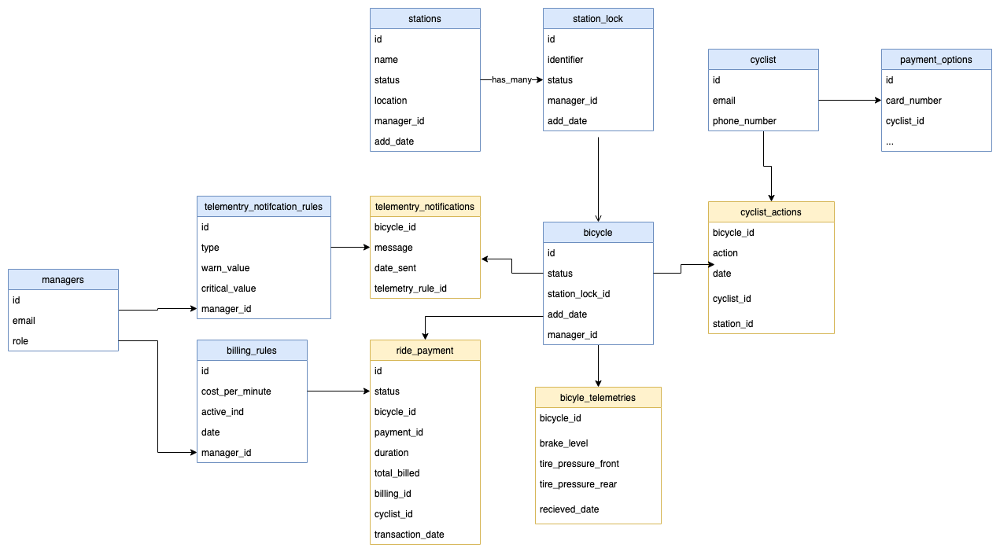

# Bicicletas Bogota Systems Design

## Overview

This is a design is for creating a system to cover the following requirements. 

1. Cyclists should be able to use a pre-paid card or smartphone app to check out (and
return) bikes at any of the stations.
2. Capacity managers at Bicicletas Bogota need the utilization rates for stations so they
can manage inventory to prevent both overcrowding and scarcity.
3. Bicicletas Bogota's billing department will charge based on ride duration.
4. Bicycle technicians need to be alerted to any issues with the bikes. Each bike is
fitted with a series of sensors that send Bicicletas Bogota information about the bike
condition (brake levels, tire pressure for front & rear tires, etc.) every 60 seconds.

## Assumptions

These are the assumptions that need validation, but what I'm assuming in this design. 

* Bicycles are capable of communicating over the internet with a server to submit their telemetry every 60 seconds. 
* The stations have a terminal with internet access and the capability of running a browser
* Users in the city will have mobile devices with internet access.
* The team is capable of build a system to add and authenticate users. 
* There is a system  built for provisioning prepaid cards. 

## High Level Diagram 

The diagram is a high level actor diagram showing the parts of the system and how they will interact with each other. There are 5 primary actors in our system. 

* The Bicycles
* The Cyclist
* Capacity Managers
* Bicycle Technicians
* Billing Department

Each actor has a different way of interacting with the system and their workflows will need to be accounted for individually. 

## Key Components

In the diagram there are three main sets components. The client side applications, the backend services and the Database. 

I'll give a brief overview of each and it's responsibility. 

### Client Applications

There are two main applications. 

A mobile web application that cyclist will use to checkout out a bike from a station, return it and process payment. 

The other application is used for administration and reporting. It will be used primarily by the Capacity Managers to get access to reports on utilization and current usage. It will also have a reporting dashboard that technicians can access to get a current list of maintenance needs. 

### Cyclist/Station App

The Cyclist Mobile App will be a web application that can be ran in any browser such that any user with a phone will be able to use the application. I would recommend to build using React and Material. The application will be responsive so it can work on a mobile device but also on a station. 

This design covers what actions happen at each primary major step of the process. Checkout, Riding, and Check In.

#### Checkout

Initiating a checkout will be the first action a user will want to take.

There are two workflows when coming into the application the user will have the choice of signing in and adding payment information or using a prepaid card. 

 * User account - They will need to sign up for an account and add payment information before checking out a Bike. Their mobile number and email will also need to be captured for contact purposes.
 * Prepaid Card - The prepaid card option will allow the user to swipe the card. The swipe will enter the number in a form on our application, or the user can manually type it in. After validating there are sufficient funds we will load the fake user associated with the card and continue. 

After successfully loading the user and validating payment information the user is then presented to the next step. 

The application will allow the user to select a station, or in the case of the terminal will present them with the current station. The station will have a kiosk mode that will only present it's stations 

The application will make a GET `/station/checkout` request with the users location to the Biking Services backend.

The backend will return with a station and if their are bicycles available offer the user the option to checkout a bike. The station will only offer bikes which are not in need of maintenance and will show the users if there is a Bike there but is in need of maintenance. (disabled)

Upon checking selecting a bike the application will make a POST `/checkout` request to the Biking Service that will add a entry into the database indicating the time the bike was checked out, by which user and also mark the bicycles as checked out.

Questions - What if the bike sensors fail during the trip?

#### Riding

While the user has a bike checked out a screen will display showing them the duration of their checkout and their overall cost for that duration. 

#### Check in

When a user has finished riding they will open the application and select the "Check In" button.

The application will make a GET `/station/checkin` request with the current location and the checked out Bicycle. 

The application will be given a list of stations that are available to check the bike into. Upon selecting the station the application will make a POST request to `/station/checkin` and provide the bicycle, and station that it will be checked into. 

The service will charge the customer based on the duration, and write to the database recording what user, bike, and end time. It will also mark the bike as checked in.

### Management Web Application

The Management Web application will be used by the administers of the system. There are a few different type of administrators. The application will provide a view for each. It will also be a mobile application as many of the users will likely be on the move either working on bicycles or moving/managing them. 

* Capacity Mangers - Provide the utilization rates of bicycles at each station and show how many are currently available at each station so they can make decisions on how to supply bicycles. This view will also allow managers to add or remove bicycles from the stations. They could access this on the go to make changes while they are at the station. 

* Technicians - View which shows bicycles status by station and can quickly see what is in need or will soon need service. It will also allow technicians to mark bicycles as unavailable so they can keep users from checking them out while they are en route to work on them. 

* Billing Department - Provide an interface which shows how much money is being made over time, and allow the billing department to adjust the cost. Further discussion on if there is need for tuning of the prices by day/hour/etc. We will assume a flat rate.

This will need to be an authenticated application which allows only those with access in. There will need to be admin functions for those to add new users and assign them roles so they only have functions to the appropriate views. The roles will line up with what is listed above in addition to a admin who can view all. 

Interactions will be described in the services section. User interfaces will support basic viewing, and editing actions based on the current users role. 
 

### Services

There will be 2 services for handling the business logic between the client applications and the database. 

These will be HTTP servers written in something such as GO to be lightweight, memory efficient and scale well. It would make sense to use an ORM since the data is relational in nature. The frontend and backend will communicate in a consistent JSON structure. 

The monitoring services has been separated out because it will be dealing with much higher traffic from all the monitoring posts coming from thing bicycles. It will load a cache of the rules on startup and will have an endpoint to cache bust when an update is made from the biking and reporting services backend. 

### Biking & Reporting Services Backend

The biking services will serve the mobile application for cyclists. It will handle the follow transactions. We will have RESTful endpoints for the models as showing in the [Database Design](#database-design). I'm outlining the endpoints below

`GET /station/` - Gets a station an a list of bicycles available for checkout based on status. Along with current billing cost. 

    Parameters - Location, User ID
    Reply - List of Bicycles at a nearby station

`POST /station/checkout` - Marks a bicycle as checked out, and enters a row in cyclist_actions indicating it's checked out. 

    Parameters - Station ID, Station Lock ID, User ID, Bicycle ID
    Reply - Start Date Time

`POST /station/checkin` - Marks a bicycle as checked in, and then process payment for the user. 

    Parameters - Station ID, Station Lock ID, User ID, Bicycle ID
    Reply - Cost

The reporting services will need to be aware of the role of the user to ensure the have access to each action they are taking. I've grouped these actions under their respective roles here. 

#### Technicians 

`GET /bicycles/` - Returns a list of all stations and bicycles with their current telemetry and and status based on telemetry rules

    Parameters - User ID
    Reply - Stations -> Bicycles -> Telementry and any Status

`POST /bicycle/status` - Sets a bicycle to a status indicated by the technician. To take it out of service or put back in. 

`POST /telemetry` - Allows user to technicians to create new telemetry rules. Rules will be inactivated instead of deleted to preserve relationships to notifications. Examples would be. Brake Level too low, Tire pressure too low.

    Parameters - User ID, Telemtry Type, Warning Value, Critical Value
    Reply - Success/Failure

#### Billing

`GET /billing` - Returns billing information for the past specified days. Can be used to report on how much revenue is being generated. 

    Parameters - User ID, Start Date, End Date
    Reply - List of transactions with cyclists, duration, and billed amount as well as the current cost per minute. 

`POST/DELETE /billing` - Creates a new billing_rule that goes into effect for new bike riders. Billing rules are never deleted only inactivated to preserve relationships and history.

#### Capacity Managers

`GET /cyclist/actions` - Returns a list of cyclist actions over a time period that can be used to analyze the volume of actions taken at a given station.

    Parameters - User ID, Start Date, End Date
    Response - List of actions over the given time period. Along with relevant station and bicycle information. 

`POST/DELETE /bicycle` - Add/Remove a bicycle to a station. A bicycle would never be removed, it could be retired from action though.

    Parameters - User ID, Station_ID, Bicycle ID (not passedo for new)
    Response - Bicycle ID

`POST/DELETE /station` - Add/Remove a station. Stations would never be removed. Could be retired.

    Parameters - User ID, Station_id (not passed for new)
    Response - Station ID

`POST/DELETE /station_lock` - Add/Remove a station lock. Stations locks would never be removed. Could be retired.

    Parameters - User ID, station_lock_id (not passed for new)
    Response - Station ID 

#### Monitoring Services System

`GET /bicycle/telemetry`

    Returns a list of telemetry rules that have been created. 

`POST /bicycle/telemetry`

    Takes a list of telemetries and persist them to the bicycle_telemtry table. 

`POST /bicycle/telemetry_notification`

    This endpoint will record the current telemetry for a bicycle and evaluate the given rules to determine if a notification should be sent to the technicians. 

    Parameters - Bicycle ID, Brake Level, Tire Pressure Front, Location, etc.. 
    Response -  Success

    
### Monitoring Services

The monitoring services exist as an interface for the bicycles themselves to record telemetry and be aware of bike status. The services also will watch telemetry and generate telemetry notifications which will be sent to the managers in the system with a role of technician based on the rules defined.

The service will load the rules, and the list of technicians into cache on server load.

In order to ensure telemetry notification delivery we should consider using a job queue system for sending mail in case of failures.

During operation as the endpoint is recieving telemtries and evaluating it will cache up a portion of rules and then flush them to disk when a certain number of an amount of time has passed. It will then proxy a request to the bicycle services backend to persist and flush it from cache. 

`POST /bicycle/telemetry` - 
    Evaluates the telemetry against the a cached set of rules. IF there is a notification it will get proxied over to the bicycle services to persist to the DB, it will then queue the notification for delivery to the technicians. 

    Parameters - Bicycle ID, Brake Level, Tire Pressure Front, Location, etc.. 
    Response -  Success

### Database Design

Below is a high level database design to cover what all is stored in the system. The data model indicates reference tables with blue, and activity tables with yellow.

Not all relationships are drawn for simplicity. This communicates the core relationships between the models.

The bicycle_telemetries table will need to be partitioned one date such that we're able to maintain performance. We should also consider archiving the data after a certain amount of time.

### Deployment

This section will cover how the services will deployed and made available. 

One thing to consider for these services, is that even in the case where we consider that cyclist could bike 24 hours a day there will be a significant drop off in activity during the night. This gives us some considerations to use scaling to save costs when there is lower activity in the system.

We have 3 conatiners that will need deployed. We will containerize all of our front end and backend services and use full VMs for Redis and the Database (Postgres DB)

#### Kubernetes

Deploy in a Kubernetes Cluster in a cloud vendor. They all have it. We can use horizontal autoscaling to make sure containers scale out during times of high traffic weekends, and daytime. This also allows us to keep cost down when it's not needed. At a minimum we should keep 2 containers up at all times in case of a failure. 

* Management Web App front end
* Cyclist Web App front end
* Bicycle Backend
* Monitoring Services
  
#### VM or Cloud Specific Services

In general Kubernetes does not do great with persistant services. These are important non-disposable entity in the system and should be treated so. Using native services usually come with benefits of automatic backups, ability to scale on demand etc.. If needed to scale we will evalaute and do so as time goes on. 

* Redis High Availability
* Postgres DB

### Additional Considerations

* Need to understand expected volume of cyclists and bicycles to take into consideration how many requests we will be handling. This could have further impact on scaling and size of services and databases
* Consider a reporting database as volume grows. Especially for telemetries as the volume will be quite high with each bicycle checking in every 60 seconds.
* All services will have monitoring in place to let technical team know about failures proactively to engage and fix. 
