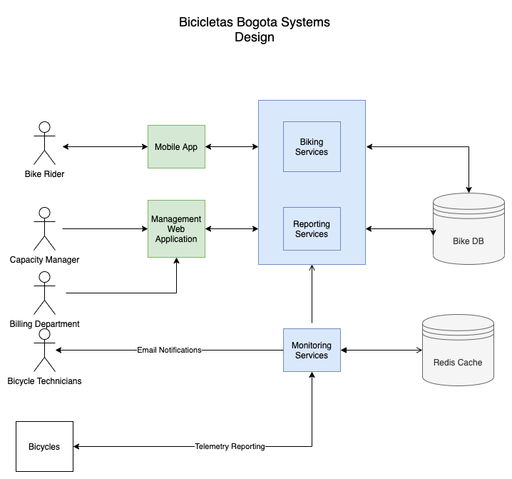

# Bicicletas Bogota Systems Design

## Overview

This is a design is for creating a system to cover the following requirements. 

1. Cyclists should be able to use a pre-paid card or smartphone app to check out (and
return) bikes at any of the stations.
2. Capacity managers at Bicicletas Bogota need the utilization rates for stations so they
can manage inventory to prevent both overcrowding and scarcity.
3. Bicicletas Bogota's billing department will charge based on ride duration.
4. Bicycle technicians need to be alerted to any issues with the bikes. Each bike is
fitted with a series of sensors that send Bicicletas Bogota information about the bike
condition (brake levels, tire pressure for front & rear tires, etc.) every 60 seconds.

## Assumptions

* Bicycles are capable of communicating over the internet with a server to submit their telemetry every 60 seconds. 
* Bicycles are capable of also knowing their location, and which station they are checked innto. 
* Bicycles can recieve a command to be checked in our checked out. And the station is sophisticated enough to handle locking the bikes in or unlocking them. 
* Users in the city will have mobile devices with internet access and location services.

## High Level Diagram 

The digram is a high level actor digram showing the parts of the system and how they will interact with each other. There are 4 primary actors in our system. 

* The Bicycles
* The Cyclist
* Capacity Managers
* Bicycle Technicians

Each actor has a different way of interacting with the system and their workflows will need to be accounted for individually. 

## Key Components

In the diagram there are three main sets components. The client side applications, the backend services and the Database. 

I'll give a brief overview of each and it's responsiblities. 

### Client Applications

There are two main applications. 

A mobile web application that cyclist will use to checkout out a bike from a station, return it and process payment. 

The other application is used for administration and reporting. It will be used primarily by the Capacity Managers to get access to reports on utilization and current usage. It will also have a reporting dashboard that technicians can acccess to get a current list of maintenance needs. 

### Cyclist Mobile App

The Cyclist Mobile App will be a web application that can be ran in any browser such that any user with a phone will be able to use the application. I would recommend to build using React and Material. 

This design covers what actions happen at each primary major step of the process. Checkout, Riding, and Check In. 

#### Checkout

Initiating a checkout will be the first action a user will want to take. They will need to sign up for an account and add payment information before checking out a Bike. Their mobile number and email will also need to be captured for contact purposes. 

After signing in and adding payment information the application will request location information to ensure the user is in range of a station. 

After doings so the application will make a GET `/station/checkout` request with the users location to the Biking Services backend. 

The backend will return with a station and if their are bicycles available offer the user the option to checkout a bike. The station will only offer bikes which are not in need of maintenance and will show the users if there is a Bike there but is in need of maintenance. (disabled)

Upon checking selecting a bike the application will make a POST `/checkout` request to the Biking Service that will add a entry into the database indicating the time the bike was checked out, by which user and also mark the bicycles as checked out. 

Questions - What if the bike sensors fail during the trip? 

##### Riding

While the user has a bike checked out a screen will display showing them the duration of their checkout and their overall cost for that duration. 

#### Check in

When a user has finished riding they will open the application and select the "Check In" button. 

The application will make a GET `/station/checkin` requestion with the current location and the checked out Bicycle. 

The application will be given a list of stations that are available to check the bike into. Upon selecting the station the application will make a POST request to `/station/checkin` and provide the bicycle, and station that it will be checked into. 

The service will charge the customer based on the duration, and write to the database recording what user, bike, and end time. It will also mark the bike as checked in.

#### Management Web Application

The Management Web application will be used by the administers of the system. There are a few different type of administrators. The application will provide a view for each. It will also be a mobile application as many of the users will likely be on the move either working on bicycles or moving/managing htem. 

* Capacity Mangers - Provide the utilization rates of bicyles at each station and show how many are currently available at each station so they can make decisions on how to supply bicyles. This view will also allow managers to add or remove bicyles from the stations. They could access this on the go to make changes while they are at the station. 

* Technicians - View which shows bicycles status by station and can quickly see what is in need or will soon need service. It will also allow technicians to mark bicycles as unavailable so they can keep users from checking them out while they are en route to work on them. 

* Billing Department - Provide an interface which shows how much money is being made over time, and allow the biling department to adjust the cost. Further discussion on if there is need for tuning of the prices by day/hour/etc. We will assume a flat rate.

This will need to be an authenticated appliation which allows only those with access in. There will need to be admin functions for those to add new users and assign them roles so they only have functions to the appropriate views. The roles will line up with what is listed above in addition to a admin who can view all. 
 

### Services

There will be 3 distinct services for handling the business logic between the client applications and the database. 

### Biking Services

### Reporting Services

### Monitoring Services

### Database Design

